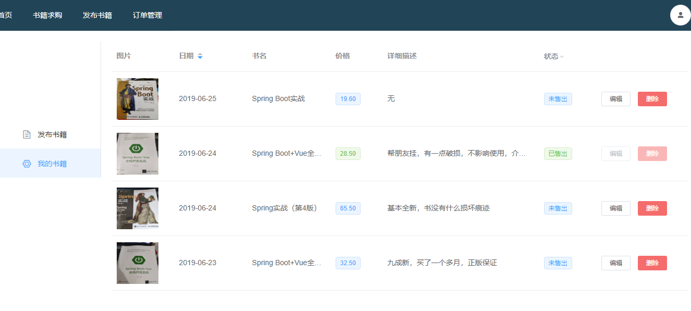

# bookstore_web

> 二手书籍交易网站前端，vue + element实现

## 功能
- 用户注册和登陆


- 书籍出售
用户发布想要出售的二手书籍




- 书籍分类及检索
根据用户发布的书籍聚合生成首页，可以分类检索，同时支持书名精确搜索，可以购买搜索到的书籍或者和卖家进行交流。


- 书籍求购
用户可以发布自己想要的书籍，其他用户可以浏览发布信息并提供帮助。


- 订单管理

用户登陆后可以管理过往所有订单，可根据已完成和未完成，购买和售出进行过滤。


- 消息模块：通过QQ推广的接口集成QQ临时对话，支持买家和卖家双向通信。(实现得并不好，可以忽略)


## Build Setup

``` bash
# install dependencies
npm install

# serve with hot reload at localhost:8080
npm run dev

# build for production with minification
npm run build

# build for production and view the bundle analyzer report
npm run build --report

# run unit tests
npm run unit

# run e2e tests
npm run e2e

# run all tests
npm test
```

For a detailed explanation on how things work, check out the [guide](http://vuejs-templates.github.io/webpack/) and [docs for vue-loader](http://vuejs.github.io/vue-loader).
